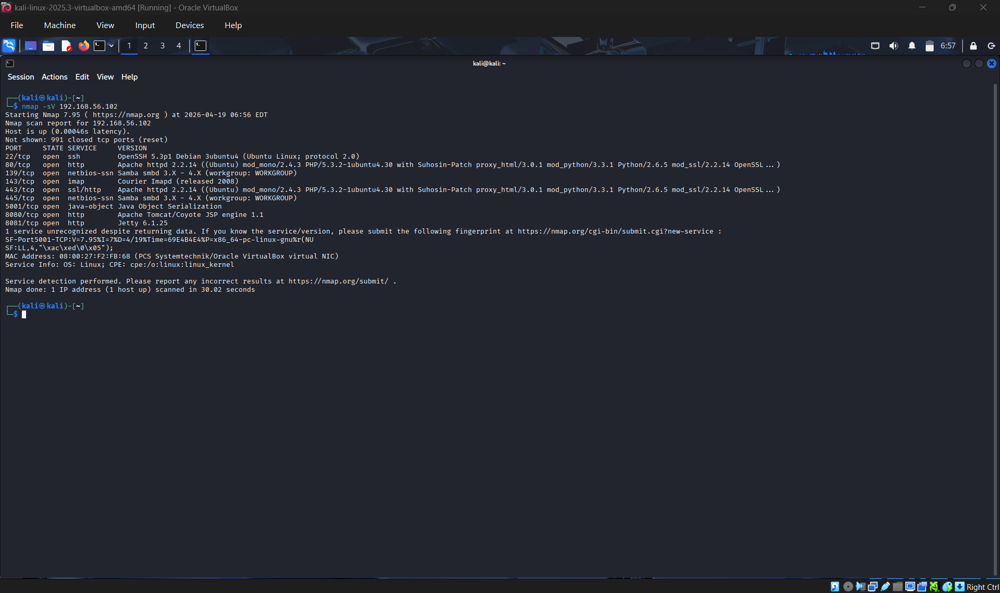
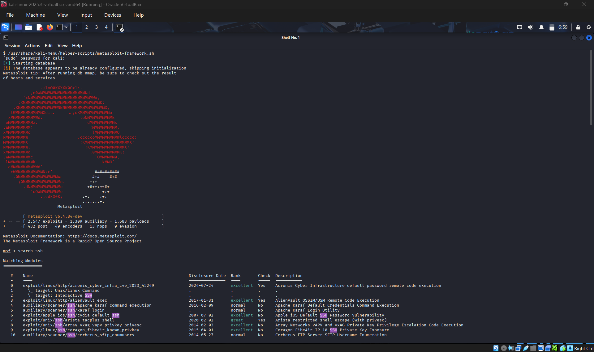
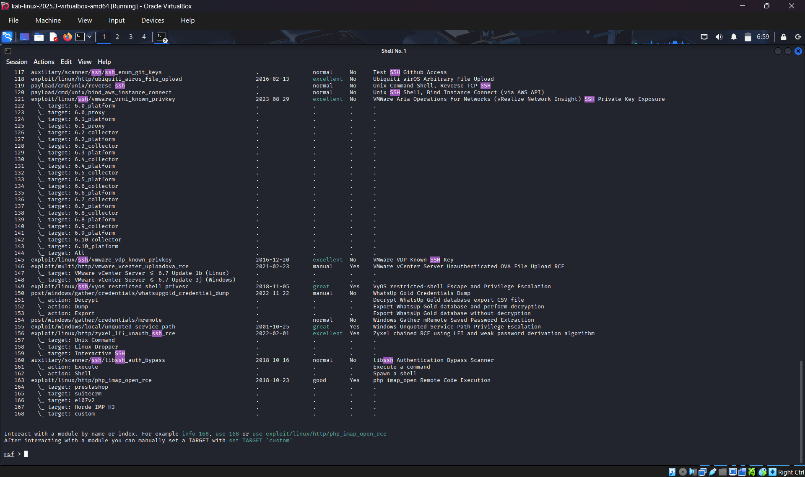
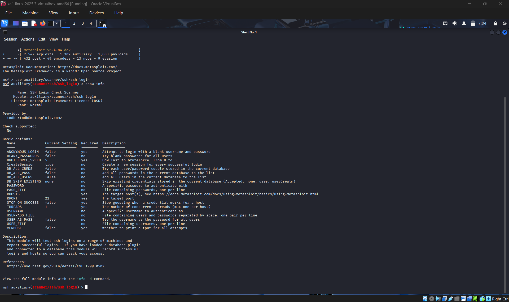
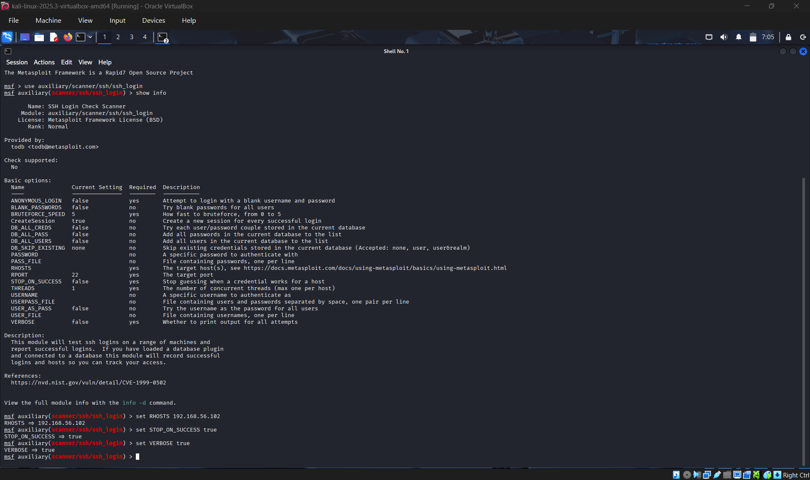
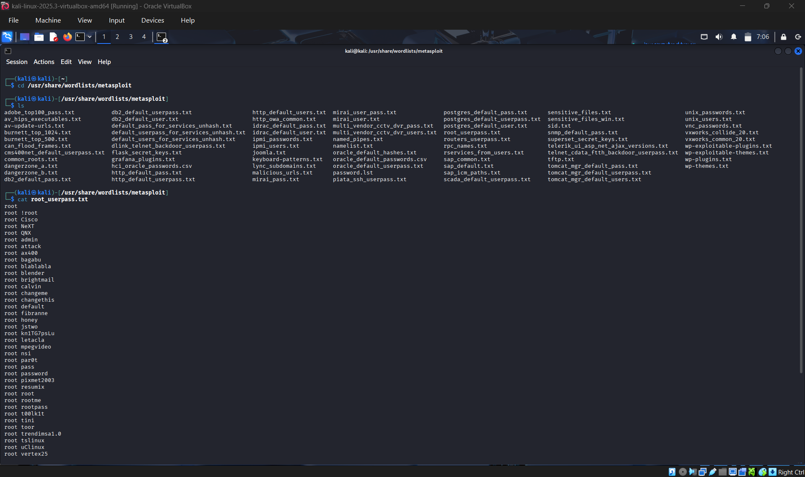
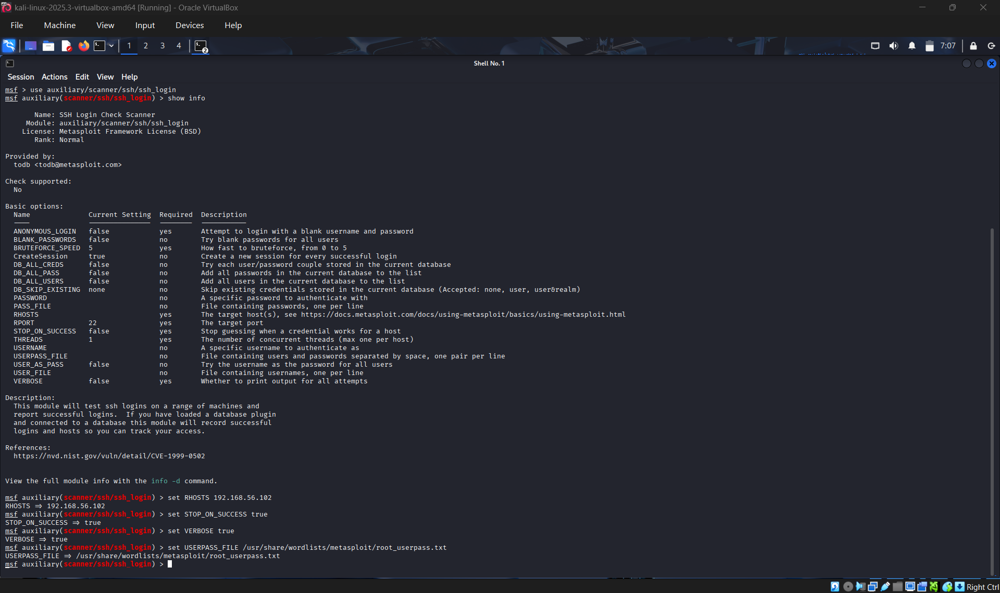
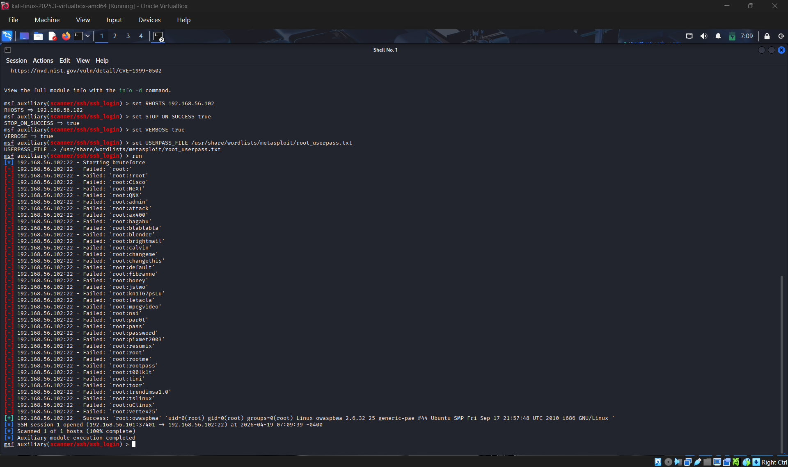

# Overview

This Lab Involved exploiting a network host using Metasploit in order to find a vulnerability and send an exploit to it. This lab involved performing a bruteforce attack in order to gain the password and login.

## Tools

1. Kali Linux Virtual Machine (Attacker)
2. OWASP Virtual Machine (Victim)
3. Metasploit
4. Nmap

## Step 1 - Scanning for open ports and services

The first step of this lab began by using Nmap on the attacker machine to scan for any open ports and services on the victim machine. The results of this scan showed that there were multiple open ports left open on the machine and many services running that could potenitally be exploited. 

## Step 2 - Exploiting OpenSSH 

Once the scan was complete and results came back I decided to use the OpenSSH on port 22 in order to find a vulnerability on the system with Metasploit. I ran Metasploit and used the **search ssh** command which allowed me to look for any vulnerabilities regarding ssh that I could exploit. Based on my research, the exploit I was looking for is used to exploit ssh credentials to gain remote access to a system. 

I ran the command **use auxuliary/scanner/ssh/ssh_login** and ran **show info** in order to see more details about the exploit and what parameters I could set. 

Once I gathered the information I needed to set to run the exploit, I began to set the parameters: 

**set RHOSTS 192.168.56.102** - This command specifies the target machine to connect to\
**set STOP_ON_SUCCESS true** - Stops trying usernames and passwords if  it find a pair that matches\
**set VERBOSE true** - This shows us the usernames and passwords being attempted\

## Step 3 - Performing Exploit

Before I ran the exploit I took some time to explore Kali Linux and see some the location of some of the passwords lists that come by default and quickly opened the one I intended to use, which used root and multiple different passwords. 

Once that was located I set the password list I wanted to use to perform the bruteforce attack.

Once that was complete I ran the exploit and it begain trying all password combinations. Once it found the correct password it completed and provided it and I was able to login to the target machine with it and it was successful.

# Learning Outcomes

What I learnt most about this lab reinforced my knwoledge of the Cyber Kill Chain. It began from the intial step of reconnaisance all the way to sending the exploit to the target. It displayed how easy it can be for attackers to scan a network and if the vulnerabilities are present, how they can exploit them in order to gain access to a system

This highlights the importance of network security and how disabling and closing unused ports and services on our networks can prevent unauthorized users from being able to gain access to our system. In addition use of strong authentication methods and other controls such and IPS, IDS, and Firewalls can continue to limit the damage than can be done by attackers.
