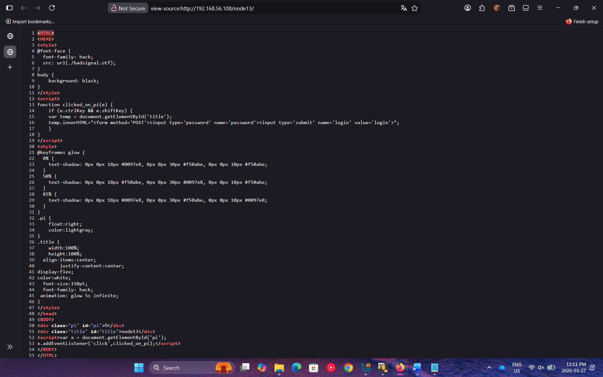
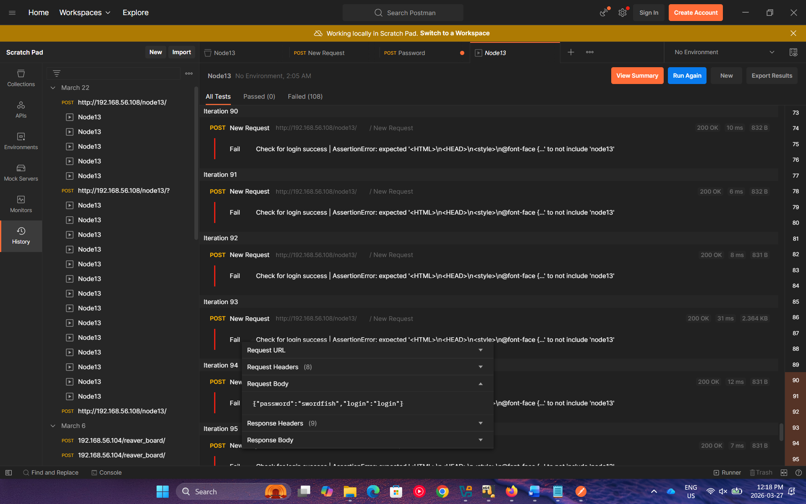
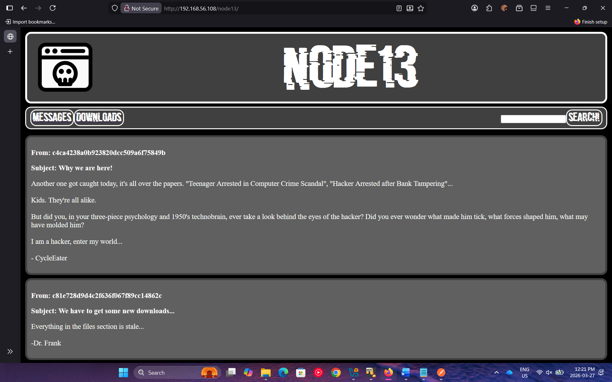
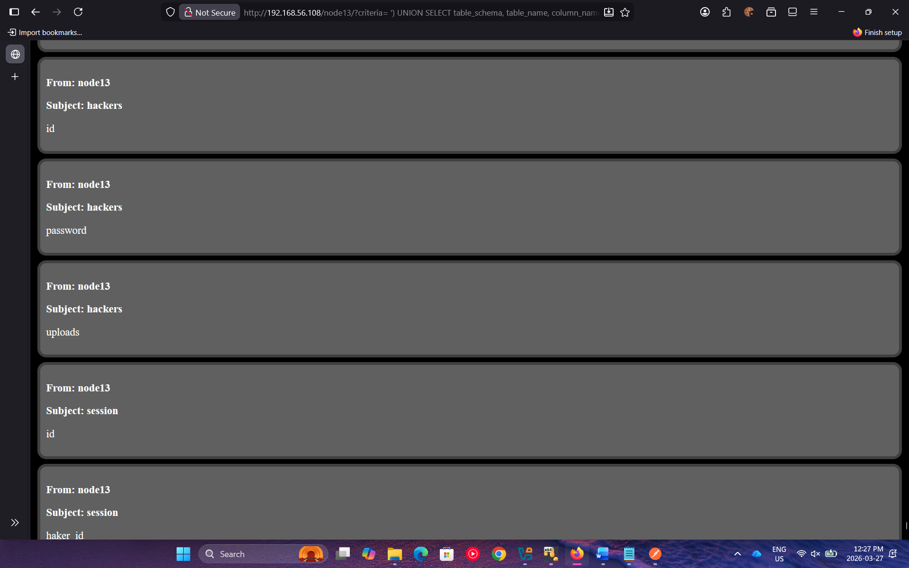

# Overview
This lab involved exploiting a web application vulnerabilities to gain remote access to a server and escalate privileges to read a restricted file. The attack involved JavaScript analysis, credential stuffing, SQL injection, file upload bypass, reverse shell, and privilege escalation using SUID binaries.

## Lab Details and Background given
Recently BigCorp Security sent a message to your team in head office saying that the firewall had flagged some
suspicious activity. A file named e349802D_complaint was exfiltrated from the corporate server. The IP that the
file was transmitted to appears to belong to a site called “node13”. Working with law enforcement you have been
given the go ahead to attempt to penetrate their website and recover your property.
Local Law Enforcement has no record of the site or the people running it. However, one of their informants is an
ex-member and says his password might still be active. He claims he could not remember exactly what it was but
that it was the title of a well-known film about hackers (all lowercase).

## Tools and Methods Used
- Postman (Password Cracking)
- Netcat (Reverse Shell)
- SQL Injection
- GTFO Bins
- Privilege Escalation

## Step 1 - Website Analysis
I began by using the IP address of the site (192.168.56.108) to access the webpage and upon seing the webpage there was a message that read "NODE13" on the screen. I noticed that there was a pi symbol in the top right corner and nothing happened when clicking on it. I examined the HTML using the inspection tools and noticed there was a simple piece of JavaScript code that required to click that pi symbol while holding Shift and Control at the same time. Upon clicking on the pi symbol again with the two keys I was given a textbox and a button that said "Login" and nothing else. I attempted some passwords and noticed that it was sending the password entered and "login" as credentials. Based on the background it was revealed that the password is the name of a well-known film about hackers. 

## Step 2 - Password Cracking
I compiled a list of well-known films about hacking into a text file and used Postman to send the password attempts to the website to find which may have worked. After running the results all failed but upon some research, I noticed that one of the password attempts had a larger size than the others and I attempted the password and I was able to login. The successful password was the 2001 movie swordfish. 

## Step 3 - SQL Injection
Upon succesfully logging in to the website, I was able to see the messages that were being posted on this website from various users whos names were displaying as hash values and upon using an online hash cracker, it revealed the usernames as regular numbers 1-9 but 5 and 8 were missing. Upon reading the messages on the website, there was mentions of an uploads section and not everyone having access to it. 

|Hash	| Result|
|-------|-------|
|c4ca4238a0b923820dcc509a6f75849b|	1
|c81e728d9d4c2f636f067f89cc14862c|	2
|eccbc87e4b5ce2fe28308fd9f2a7baf3|	3
|a87ff679a2f3e71d9181a67b7542122c|	4
|1679091c5a880faf6fb5e6087eb1b2dc|	6
|8f14e45fceea167a5a36dedd4bea2543|	7
|45c48cce2e2d7fbdea1afc51c7c6ad26|	9

I navigated to the Downloads section of the website to see more documents that were there and I examined more of the HTML and noticed that they were being saved to a path callled http://192.168.56.108/node13/files/ and I navigated to it to see the uploaded files. In order for me to get more information I decided to perform a SQL injection on the search bar at the top to see if I can get more information about the database. I ran 
http://192.168.56.108/node13/?criteria=%20%27)%20UNION%20SELECT%20table_schema,%20table_name,%20column_name%20from%20information_schema.columns;

Based on the results of this command, I was given information into the different tables in the database and there was mentions of a hackers table with id, password, and uploads. There was also a table sessions that had id, hacker id. 

I used this command to querie the hackers table and I was able to see the used id and hashed passwords for all users, however even after using the hash cracker the passwords did not work. http://192.168.56.108/node13/?criteria=%20%27)%20UNION%20SELECT%20null,%20CONCAT(table_schema,%27%20%27,%20table_name),%20column_name%20from%20information_schema.columns; 

I then ran a different command to querie the session table instead and I was able to see the hashed session numbers for all users including user 5 and 8.

|Hash | Session|
|--------|--------|
|5a4269fa451889eefcd255f3addc3e3b| A681
|7e69f3cbeccb8a05feb3be1bd81e84fa| A398
|0035d41f977e4814921e3f642307eb93| A474
|17a256d8b54f52f8029ccdb1ca52e426| A247
|3207334d535a4de66a1a48b652cea0e4| A611
|f44c4c0c7c34124f906a229908d56a01| A699
|f3d259d3a861c613c90874fec9b428a9| A206
|f1ccfe316ed346d19c1865e5134d631c| A154
|7946287226fc8b91547c38d913122608| A177
|4c49c58b56a1a311df7a57896664eb24| A986
|2f72e4f4112efeb63b9fb0ed1eefd1c9| A250
